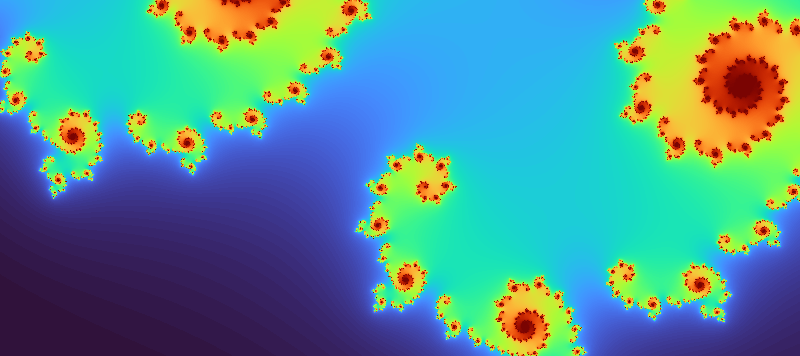
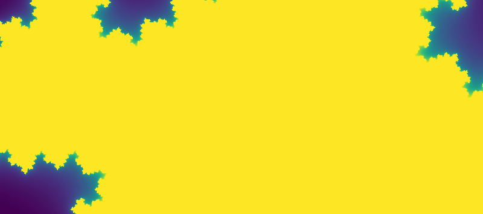
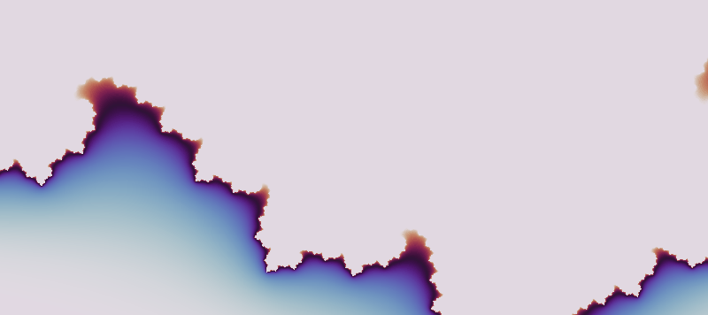

# Julia Set Viewer

Interactive **Julia Set explorer** built with **Python** and **Tkinter**, featuring real-time rendering, smooth navigation, animated parameter exploration and GIF export.

The application allows users to explore the fascinating world of Julia sets by interactively changing the complex parameter **c**, zooming into intricate self-similar structures and generating high-quality images and animations.

---

## Animated Examples

<p align="center">


</p>

<p align="center">


</p>

---

## Features

- Interactive Julia Set rendering
- Rectangle zoom with aspect ratio correction
- Mouse wheel zoom
- Smooth panning
- Progressive rendering (fast preview + full-quality refinement)
- Optional Numba acceleration
- Automatic iteration scaling
- Multiple color palettes
    - Plasma (default)
    - Viridis
    - Magma
    - Inferno
    - Turbo
    - Cividis
    - Twilight
    - SoftSunset
    - EarthAndSky
    - Seashore
    - Forest
    - HotAndCold
    - Pastel
    - Grayscale
	- Jade
    - Pearl
- Gamma adjustment
- Julia parameter editor
    - Real component
    - Imaginary component
- Built-in Julia presets
- Animated parameter exploration
- High-resolution PNG export
- Animated GIF export
- Keyboard shortcuts
- Responsive Tkinter interface

---

## Controls

### Mouse

- Left Drag → Rectangle Zoom
- Mouse Wheel → Zoom
- Right Mouse Button → Reset View

---

### Keyboard

| Key | Action |
|------|--------|
| Z | Zoom In |
| X | Zoom Out |
| R | Reset View |
| S | Save PNG |
| G | Save GIF |
| C | Next Color Palette |
| I | Toggle Auto Iteration |
| ESC | Exit |

---

## Julia Parameter

Unlike the Mandelbrot Set, every Julia Set is generated using a fixed complex parameter

```
z(n+1) = z(n)² + c
```

Changing the value of **c** produces completely different fractal structures.

Use:

- Real Slider
- Imaginary Slider
- Presets
- Animate c

to explore thousands of unique Julia Sets.

---

## Progressive Rendering

To keep the interface responsive, the viewer renders images in two stages.

1. Low-resolution preview while interacting
2. Full-resolution refinement after interaction stops

This provides smooth navigation even during deep zooming.

---

## GIF Animation

The viewer can automatically animate the Julia parameter around a small circular path.

Features

- 5-second animation
- 15 FPS
- Circular parameter orbit
- Current palette preserved
- Current gamma preserved
- Export as animated GIF

---

## Performance

The viewer supports optional **Numba** acceleration.

If Numba is installed, computational kernels are automatically compiled using LLVM, significantly improving rendering speed during interactive exploration.

Without Numba the application automatically falls back to the NumPy implementation.

---

## Installation

Create a new environment

```bash
conda create -n julia-set-viewer python=3.12
conda activate julia-set-viewer
```

Install dependencies

```bash
pip install numpy pillow matplotlib
```

Optional acceleration

```bash
pip install numba
```

---

## Run

```bash
python julia_set_tk.py
```

---

## Gallery

Examples generated using different Julia parameters.

- Spiral structures
- Dendrites
- Snowflake-like formations
- Sea-horse patterns
- Organic branching
- Self-similar islands
- Deep zoom examples

---

## Technologies

- Python
- NumPy
- Tkinter
- Pillow
- Matplotlib
- Numba (optional)

---

## Future Improvements

- Multiple animation paths
- Random Julia generator
- Favorite parameter library
- Orbit visualization
- Distance estimation shading
- Histogram coloring
- Anti-aliasing
- Multi-threaded rendering improvements
- 4K image export

---

## License

Apache License 2.0